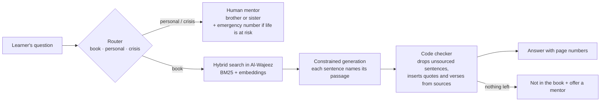

<div align="center">


# theislam.chat — ما بعد الشهادة · After the Shahada

**When someone declares the Shahada in a chat, it should not be their last message — it should be their first lesson.**

**[▶ Watch the 2-minute film](https://shahada.theislam.chat/video)** · **[Try it live](https://shahada.theislam.chat/ar?demo=shahada)** ([English](https://shahada.theislam.chat/en?demo=shahada)) · **[Presentation (PDF)](docs/deck/theislam-chat-after-shahada.pdf)** · **[Evaluation](docs/evaluation.md)** · **[Testimonial](https://shahada.theislam.chat/testimonial)**

Track 03 — Interactive experiences and the learning journey · AI in the Service of Islamic Content Challenge 2026 · applicant: Osoul Association (جمعية أصول)

</div>

> **عربي باختصار:** حين يعلن إنسانٌ إسلامه في محادثة theislam.chat، تبدأ في المحادثة نفسها رحلة تعلّم من كتاب «الوجيز: منهج تعليم صفي للمسلم الجديد» (مركز أصول) بلغته: درسٌ أول في معنى الشهادتين، ثم مسارٌ يحفظ تقدمه، وجوابٌ عن كل سؤال تُسند كل جملة فيه إلى صفحة من الكتاب، والآيات والاقتباسات يُدرجها الكود من مصادرها ولا يكتبها الذكاء الاصطناعي. والفتوى الشخصية والأزمات تذهب إلى مرشد بشري: أخ للإخوة وأخت للأخوات، ومعها منصة متابعة لفريق المرشدين.

## At a glance

| | |
|---|---|
| **The platform** | theislam.chat (Osoul Association, since Oct 2024): 16,653 conversations · 150 countries · 52 languages |
| **The gap** | 166 conversations ended with a Shahada; only 11 left a way to be reached, 89 ended within two messages, 22 asked "how do I pray?" |
| **What we built** | A learning space that opens in the same chat: Al-Wajeez (4 units, 19 lessons, 10 language editions), sourced answers, verbatim worship steps, listen-and-repeat, the whole book, human mentors, a mentors' platform, sign-in and daily lessons |
| **Reliability** | Every answer sentence cites a book passage; a code checker deletes any sentence without one; verses come from Tanzil/QuranEnc. In testing: 0 invented rulings; 100% faithful answers on the final never-seen set |
| **Results** | 88.0% correct behaviour on 150 never-seen questions · 90.8% on 284 audit questions · 84/84 Shahada-moment scenarios · 100% verbatim quotes vs. 92.1% for the same model without the checker |
| **Built** | 4–6 October 2026, open source, in this repository |

## How an answer is made



## Repository map

| Folder | What is inside |
|---|---|
| [`service/`](service/) | The service (TypeScript, Fastify, SQLite): answers, router, checker, lessons, accounts, mentors' platform API, tests |
| [`web-module/`](web-module/) | The learning space shown inside theislam.chat (Vue 3) |
| [`mentor-app/`](mentor-app/) | The mentors' follow-up platform (Vue 3), served at `/mentor` |
| [`platform-patch/`](platform-patch/) | The small patch to the existing theislam.chat interface |
| [`content/`](content/) | Curriculum structure, Sharia review log, fixed messages in 20+ languages, the da'wah prompt, passage manifests (ids + SHA-256, no book text) |
| [`scripts/`](scripts/) | Book conversion (PDF → page-tagged text), chunking, indexing, Qur'an translations |
| [`eval/`](eval/) | Locked and held-out question sets, Shahada scenarios, audit tools and judged results |
| [`docs/`](docs/) | Presentation, evaluation report, API, film production notes, screenshots, submission texts |
| [`video/`](video/) | The film pipeline (recording, voice, graphics, mix) |
| [`stats/`](stats/) | Aggregate platform statistics (no conversation text) |

## The problem

In the platform's export of 8 Sept 2026, the assistant congratulated a user on entering Islam in **166** conversations; only **11** users left any way to be contacted, **89** conversations ended within two messages, and **22** users asked how to make wudu, how to pray, or what to do now — which the platform is deliberately forbidden to teach from model memory. (`stats/` recomputes these numbers from the export; no conversation text is included.)

## What was built on 4–6 October 2026

| Part | What it does | Code |
|---|---|---|
| Integration patch | After the congratulation the assistant emits `<shahada/>`; the theislam.chat interface shows a journey card under that message, which opens the full-screen learning space (path · lesson · ask; one screen with tabs on phones) | `platform-patch/bot-chat-guide.diff` (430 lines against the tagged pre-challenge version, including the chat rendering fixes), `web-module/src/space/`, `content/prompts/dawah.md` |
| Start card | Language, former religion, country and topic — each only if the user said it, shown with the user's own sentence (verified by code), editable, nothing stored until confirmed | `service/src/profile.ts`, `web-module/src/space/Onboarding.vue` |
| Curriculum | Al-Wajeez's 4 units / 19 lessons; first the Shahada lesson, then the user's choice (wudu, prayer, Al-Fatiha, not sure), purification and prayer, then the book in order — fixed rules in code, unit-tested | `content/structure.json`, `service/src/curriculum.ts`, `service/test/` |
| Lessons | Summary sentences each linked to their passage and page; the steps of wudu, ghusl and prayer shown **verbatim** from the book; verses from Tanzil with QuranEnc meanings; a comprehension question; lessons not yet reviewed show only the book text | `service/tools/build_lessons.ts`, `service/src/lessons.ts`, `content/review.json` |
| Questions | Hybrid retrieval (BM25 + gemini-embedding-2) → constrained generation where **every sentence must name a retrieved passage** → a **code-only checker** that drops unsupported sentences, rejects text quoted from nowhere, inserts quotes and verses from the sources, regenerates once if more than a third is dropped, otherwise apologises and offers a mentor | `service/src/answer.ts`, `service/src/checker.ts`, `service/src/book.ts` |
| Router | Two independent signals — a fixed multilingual list of crisis/self-harm phrases and a model label (curriculum, beyond the book, personal fatwa, crisis, practical need, scholarly difference, unsure). Either one refers. Self-harm shows the country's emergency number first. Labels are never stored on the user | `service/src/router.ts`, `service/src/messages.ts` |
| Human referral | Brother or sister mentor, a short card the user sees and consents to (language, stated country, lesson, reason, question); the reply is delivered in the chat when the user returns | `service/src/server.ts`, `web-module/src/HandoffDialog.vue` |
| Follow-up platform | The mentors' app at `/mentor`: accounts and roles (mentor, supervisor), case inbox with filters, crisis alerts and overdue highlights, a case page (referral card, conversation with canned replies, assignment, status, internal notes, timeline), error-report review and aggregate numbers | `service/src/mentor.ts`, `mentor-app/` |
| Learning space | After the Shahada the chat shows one journey card that opens a full-screen space: the learner's path with progress, a lesson reader, and an ask panel with live answer stages; one screen with a bottom tab bar on phones | `web-module/src/space/` |
| Account | Google sign-in or e-mail link; the next lesson by e-mail at the hour the user picks; "delete my data" | `service/src/server.ts`, `service/src/mail.ts` |
| Languages | 10 editions converted to text (ar, en, fr, es, id, pt, ru, bs, vi, th); other languages get a "machine-translated explanation — original attached" answer from the English/Arabic text | `scripts/extract_book.py`, `scripts/build_chunks.py` |
| Evaluation | 200 locked questions + 100 dev + 120 simulated journeys, hashed before building; two systems (ours vs. the same model and passages without checker/router); independent judge | `eval/`, `service/tools/run_eval.ts`, `service/tools/run_journeys.ts`, `service/tools/score.ts` |

Results: see [`docs/evaluation.md`](docs/evaluation.md) (locked set, the 6 October audit, and the never-seen set) and the blind review in [`eval/human_review.md`](eval/human_review.md).

Since the locked run, also built (disclosed in the report): live answer stages, a 24-hour answer cache, listen-and-repeat recitation (Al-Minshawi's teaching Mushaf and Alafasy, mp3quran.net) for Al-Fatiha, the short surahs and prayer, interactive exercises from the book's own assessment questions, and a fallback that shows the book's verbatim steps for "how do I perform…" questions on wudu, ghusl and prayer.

## Submission materials

| Deliverable | Where |
|---|---|
| Live demo | https://shahada.theislam.chat (`/ar?demo=shahada`, `/en?demo=shahada`); follow-up platform at `/mentor` (demo accounts: supervisor@, brother@, sister@demo.theislam.chat, password `6c014c6af52e`) |
| Presentation (challenge template) | [`docs/deck/theislam-chat-after-shahada.pdf`](docs/deck/theislam-chat-after-shahada.pdf) (+ PPTX), rebuilt by `docs/deck/build_deck.py` |
| Video (≤ 2 min) | [shahada.theislam.chat/video](https://shahada.theislam.chat/video) — built by the pipeline in [`video/`](video/), documented in [`docs/video.md`](docs/video.md) |
| Evaluation | [`docs/evaluation.md`](docs/evaluation.md), raw rows in `eval/results/` |
| Sources and licences | [`SOURCES.md`](SOURCES.md) |
| Sharia review of lessons | `content/review.json` (who approved what, and how) |
| API | [`docs/api.md`](docs/api.md) |

## Run it

```bash
# 1. Rebuild the book text and indexes (needs GEMINI_API_KEY; PDFs are public)
python3 scripts/extract_book.py en && python3 scripts/build_chunks.py en && python3 scripts/build_index.py en
python3 scripts/fetch_quranenc.py   # translations of meanings; Tanzil text goes to data/quran/quran-uthmani.txt
cd service && npm install && npx tsx tools/build_lessons.ts en

# 2. Start the service (http://localhost:8080)
cp ../deploy/.env.example ../.env   # fill the keys
npm run dev

# 3. Tests and evaluation
npm test
npx tsx tools/run_eval.ts dev && npx tsx tools/score.ts ../eval/runs/<file>.jsonl
npx tsx tools/run_journeys.ts --base http://localhost:8080
```

Production: `deploy/docker-compose.yml` (one container behind nginx/Cloudflare on midade-vps).
The frontend is the theislam.chat interface (`bot-chat-guide`, private) at tag `pre-challenge-2026-10-03` plus `platform-patch/bot-chat-guide.diff`, with the module components from `web-module/src/`.

## Disclosure (terms §8 and §9)

- **Existing before the challenge, not submitted for evaluation:** the theislam.chat platform (Osoul Association, live since October 2024): its interface, voice chat, "talk to a human" button, and its da'wah prompt. Promo of the original platform: [«اكتشف الإسلام من خلال الحوار | Chat & Decide»](https://youtu.be/ceo9dsxPZrI). The versions are tagged `pre-challenge-2026-10-03` in the platform repositories.
- **Built during 4–6 October 2026:** everything in this repository (see the commit history) and the integration patch.
- **Prepared on 4 October before writing code:** the book's conversion to text and the frozen evaluation sets (`eval/LOCK.sha256`, first commit). The 30 critical test cases were written by the team member who also built the router, which we state openly; they were frozen in the first commit and not changed after.
- **Sources, models, tools and licences:** [`SOURCES.md`](SOURCES.md). No real user conversation is used in the code, tests, demo or repository.
- **Not covered by our claims:** we measure the curriculum's order, sourcing, abstention and referral with simulations and fixed sets; we do not claim improved understanding among real new Muslims within the challenge period.
